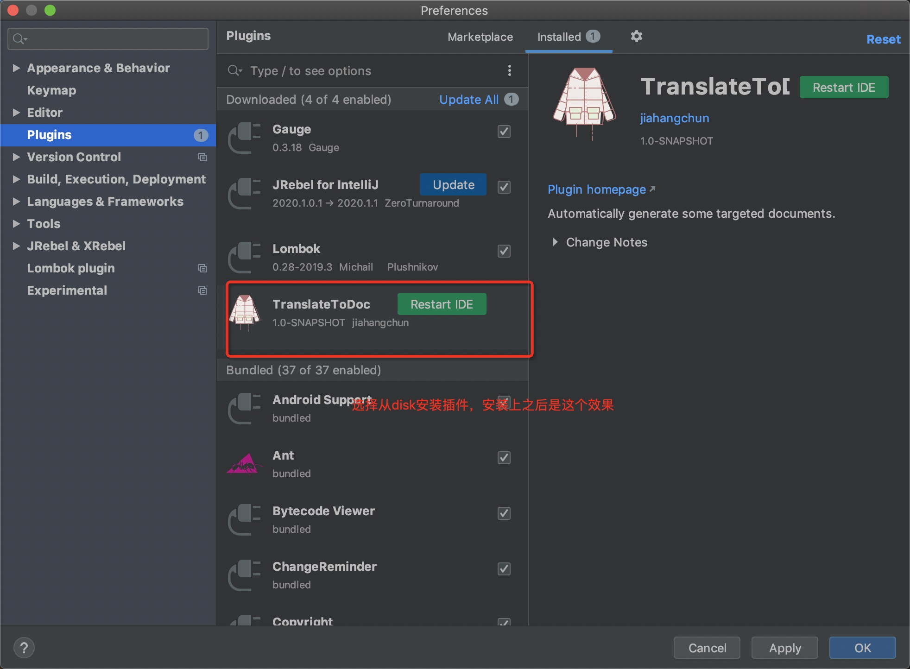
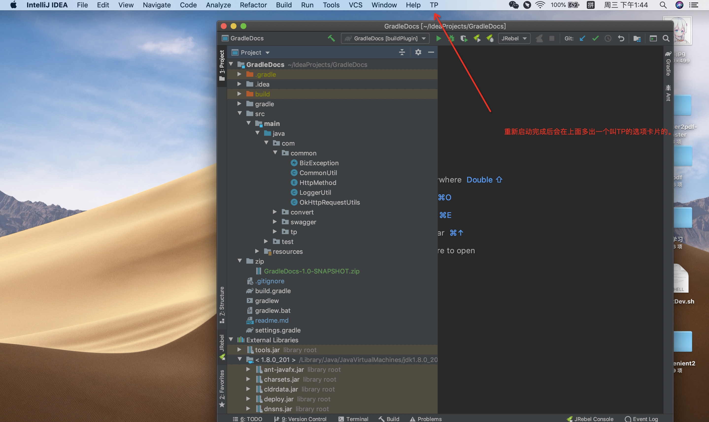
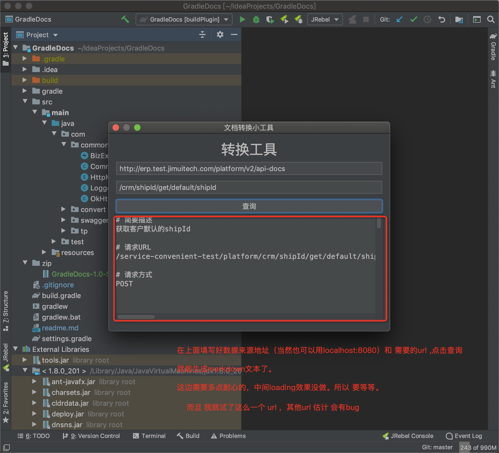
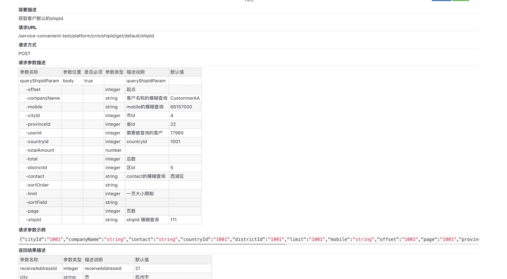
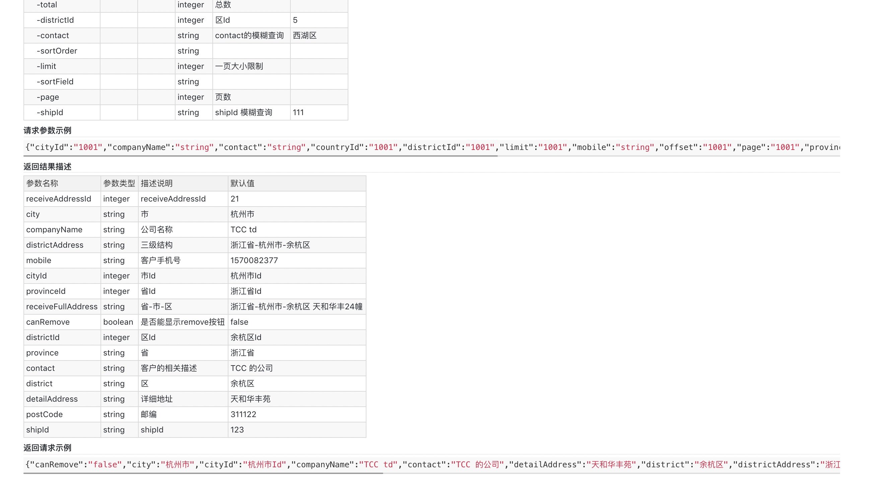

# how to use  
按照idea硬件安装的方式当前插件就可以了,可以参考[Doc](https://www.jetbrains.com/help/idea/managing-plugins.html)  
plugin 放在了 根目录 的zip 文件夹下面了

# version
目前现有的提供了 idea20190301 & idea201701版本。  
如果自己的idea不是这两种会报错：Xxx is incompatible with this installation   
放心，我也提供了相应的解决办法：
修改 build.gradle 文件中的 intellij.version 从"2019.3.1"到你自己的版本号(点击左上角的About Idea Xxx)，重新 打包编译，生成zip包（看下面）

# 使用教程 
翻墙查看效果(要全局代理模式)  
安装  
  
  
使用  
  
  
效果  
  
  

# 约定大于配置
限制,比如  
1. 现在只支持post & get 操作;  
2. 入参和出参 我都最多支持两层结构；  
3. 复杂对象 不展示，或者展示出错;  
4. 不支持 path 路径  
5. 不会去实际请求结果的，只会根据swagger数据按照一定的格式组合成json。

# bug 
我就还没来得及测试过，只是简单尝试了下接口(/crm/shipId/get/default/shipId).bug完全没修过，本着遇到一个改一个的原则去弄的。    
然后我就修我经常使用的两请求方式就可以了。
```
1. post请求       示例：/crm/shipId/get/default/shipId,
2. get请求        示例：/crm/shipId/get/{shipId}
```

### developer test & build
run DocTest.main        测试主要方法  
or ```run gradle```     测试plugins文档上有的   

```gradle -> Tasks -> intellij -> buildPlugin```
另外不要用 ```gradle build```去打包，到时候会出现文件找不到引用的错误  
也不要转成 maven，然后通过BuildDev的方式去生成zip，因为到时候也会出现引用的相关问题  

### about lombok  
千万不要用lombok，虽然人家[官网](https://plugins.gradle.org/plugin/io.freefair.lombok )上说支持了  
到实际真没支持，到时候一堆红色警告，然后能编译，但是就是运行会出问题 
  
### GUI DESIGNER   
这个gradle好像不支持的，只能用maven去生成下，然后让它自动生成UI.  
可以[参考](https://www.iteye.com/blog/panyongzheng-1897722)  

### idea plugin doc  
[gradle build plugin](https://www.cnblogs.com/hama1993/p/12034514.html)  
[doc](https://www.jetbrains.org/intellij/sdk/docs/tutorials/build_system/gradle_guide.html)  
[gradle deployment](https://www.jetbrains.org/intellij/sdk/docs/tutorials/build_system/deployment.html)  

### todo  
1. bugfix .....  
2. 按钮要一个loading效果，然后要有进度条等等。  
3. swing界面是真得丑.我想要[WePush](https://github.com/rememberber/WePush)这样的效果  
