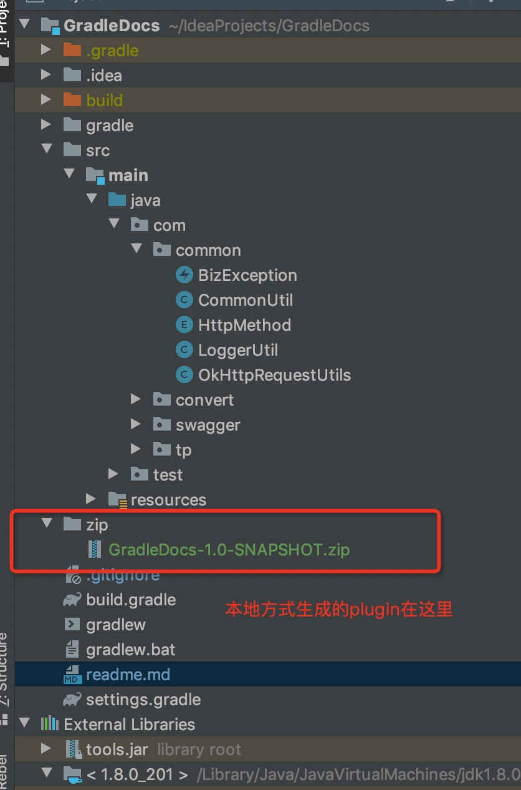

# how to use  
按照idea硬件安装的方式当前插件就可以了,可以参考[Doc](https://www.jetbrains.com/help/idea/managing-plugins.html)  
plugin 放在了 根目录 的zip 文件夹下面了

# 约定大于配置
在这个的开发过程中，我设置了许多的限制条件。  
比如  
1. 现在只支持post & get 操作;  
2. 入参和出参 我都最多支持两层结构；  
3. 复杂对象 不展示，或者展示出错;  
4. 不支持 path 路径  

# 实际效果  
翻墙查看效果
  
  
  
  
  
  
  


# bug 
第一次 先用 convenient的dev-200120-jhc-swaggerVersion分支测试吧。   
我就还没来得及测试过，只是简单尝试了下接口：/crm/shipId/get/default/shipId   
bug完全没修过，本着遇到一个改一个的原则去弄的  

## developer test & build
run DocTest.main 测试主要方法  
or run gradle    测试plugins文档上有的   

gradle -> Tasks -> intellij -> buildPlugin  
另外不要用 ```gradle build```去打包，到时候会出现文件找不到引用的错误  
也不要转成 maven，然后通过BuildDev的方式去生成zip，因为到时候也会出现引用的相关问题  

# warn  

### about lombok  
千万不要用lombok，虽然人家[官网](https://plugins.gradle.org/plugin/io.freefair.lombok )上说支持了  
到那时实际真没支持，到时候一堆红色警告，然后能编译，但是就是运行会出问题 
  


### GUI DESIGNER   
这个gradle好像不支持的，只能用maven去生成下，然后让它自动生成UI.  
可以[参考](https://www.iteye.com/blog/panyongzheng-1897722)  


### idea plugin doc  
[gradle build plugin](https://www.cnblogs.com/hama1993/p/12034514.html)  
[doc](https://www.jetbrains.org/intellij/sdk/docs/tutorials/build_system/gradle_guide.html)  
[gradle deployment](https://www.jetbrains.org/intellij/sdk/docs/tutorials/build_system/deployment.html)  

### todo  
1. bugfix .....  
2. 按钮要一个loading效果，然后要有进度条等等。  
3. swing界面是真得丑.我想要[WePush](https://github.com/rememberber/WePush)这样的效果  
